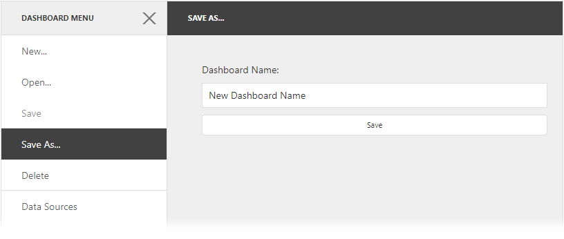

<!-- default badges list -->

<!-- default badges end -->

# Dashboard for ASP.NET Core - How to implement Save As and Delete functionality by creating custom extensions

This example demonstrates how to add the "Save As" and "Delete" [menu items](https://docs.devexpress.com/Dashboard/117444) to the Web Dashboard's UI by implementing the corresponding [custom extensions](https://docs.devexpress.com/Dashboard/117543):

* The "Save As" menu item allows end-users to save the current dashboard with a new name.
* The "Delete" menu item deletes the opened dashboard from the [dashboard storage](https://docs.devexpress.com/Dashboard/116299).

The image below shows the result of the extensions implementation.

## Files to Review

* [HomeController.cs](./CS/AspNetCoreDashboard/Controllers/HomeController.cs)
* [Program.cs](./CS/AspNetCoreDashboard/Program.cs)
* [CustomDashboardFileStorage.cs](./CS/AspNetCoreDashboard/Storages/CustomDashboardFileStorage.cs)
* [Index.cshtml](./CS/AspNetCoreDashboard/Pages/Index.cshtml)
* [_Layout.cshtml](./CS/AspNetCoreDashboard/Pages/_Layout.cshtml#L19-L23)
* [DeleteExtension.js](./CS/AspNetCoreDashboard/wwwroot/js/DeleteExtension.js)
* [SaveAsExtension.js](./CS/AspNetCoreDashboard/wwwroot/js/SaveAsExtension.js)

## Documentation

- [Extensions Overview](https://docs.devexpress.com/Dashboard/117543/web-dashboard/ui-elements-and-customization/extensions-overview)
- [Prepare Dashboard Storage](https://docs.devexpress.com/Dashboard/116299/web-dashboard/aspnet-web-forms-dashboard-control/prepare-dashboard-storage)

## More Examples

- [Web Forms Dashboard - How to implement the Save As and Delete functionality by creating custom extensions](https://github.com/DevExpress-Examples/web-dashboard-how-to-implement-save-as-and-delete-by-creating-custom-extensions-t466761)
- [MVC Dashboard - How to implement the Save As and Delete functionality by creating custom extensions](https://github.com/DevExpress-Examples/mvc-dashboard-how-to-define-extensions-providing-the-save-as-and-delete-functionality-t504201)
- [Dashboard for Angular - How to implement Save As and Delete functionality by creating custom extensions](https://github.com/DevExpress-Examples/DashboardCoreAngularSaveAsExtension)
<!-- feedback -->
## Does this example address your development requirements/objectives?

 

(you will be redirected to DevExpress.com to submit your response)
<!-- feedback end -->
